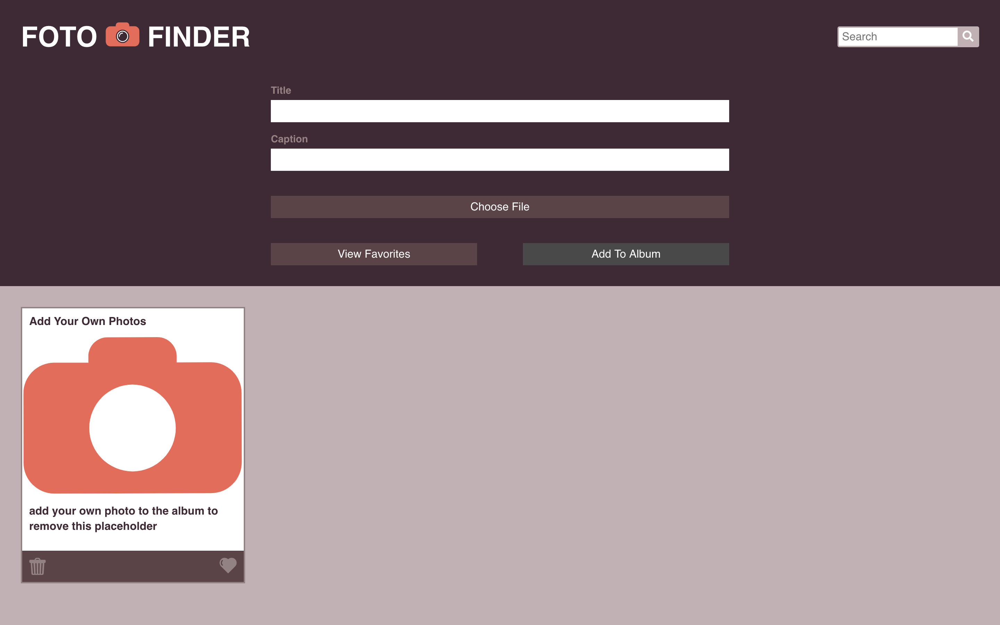

# Foto Finder

## Synopsis
  Foto Finder is a photo album application. Users can upload their own images with a title and a caption which are then saved to local storage. Users can favorite images and filter the page to see only their favorites. Users can edit the title, caption, and image of each photo, and they can also search for their images by title and caption.

## Screenshots
  Original Desktop Comp:
  

  My Desktop Version:
  

  Original Mobile Comp:
  

  My Mobile Version:
  

## Contributor
* Jeo D
